# yolo26_plate_recognition_tensorrt

**yolo26-plate 车牌检测 + 车牌识别 | 中文车牌 | 支持12种车牌类型 | 支持双层车牌**
**C++ | TensorRT 推理加速**

---

## 写在前面

本项目是对 [yolo26-plate](https://github.com/we0091234/yolo26-plate) 仓库的 C++ 算法移植，使用 TensorRT 进行推理加速，可实现不同形式中文车牌的检测与识别，支持识别车牌号码、车牌颜色和车牌类型。

项目包含两个独立模块：

- **检测模块**（`yolov26_pose`）：基于 YOLOv26-pose，输出车牌检测框和四角关键点。
- **识别模块**（`plate_recognition`）：基于 CRNN + CTC，输出车牌号码和颜色。

---

## 支持的车牌类型

| 类型 | 颜色 |
|---|---|
| 普通小型车 | 蓝色 |
| 普通大型车 | 黄色 |
| 新能源小型车 | 绿色 |
| 新能源大型车 | 黄绿色 |
| 警用车牌 | 白色 |
| 武警车牌 | 白色 |
| 军用车牌 | 白色 |
| 港澳车牌 | 黑色 |
| 使领馆车牌 | 黑色 |
| 双层黄牌 | 黄色 |
| 双层农用车 | 黄色 |
| 学车号牌 | 黄色 |

---

## 测试环境

本项目在 **NVIDIA Jetson Orin NX 16G** 上完成测试。

| 组件 | 版本 |
|---|---|
| Ultralytics | 8.3.225 |
| Python | 3.10.12 |
| CUDA | 12.6.85 |
| CuDNN | 9.19.1.2 |
| TensorRT | 10.7.0.23 |
| OpenCV | 4.10.0 |

---

## 效果展示

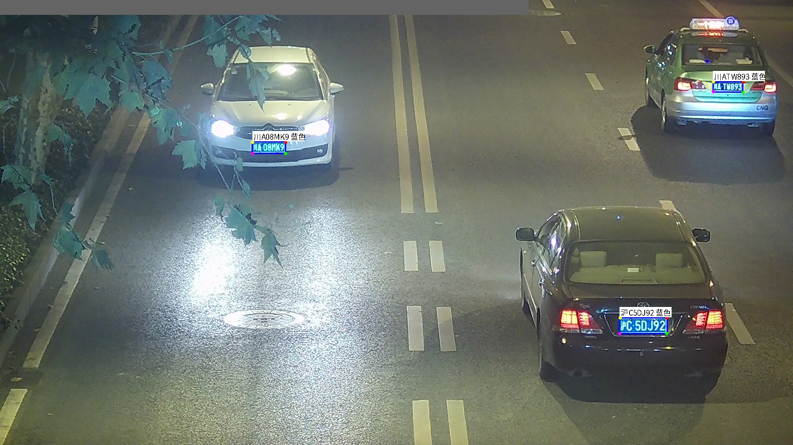
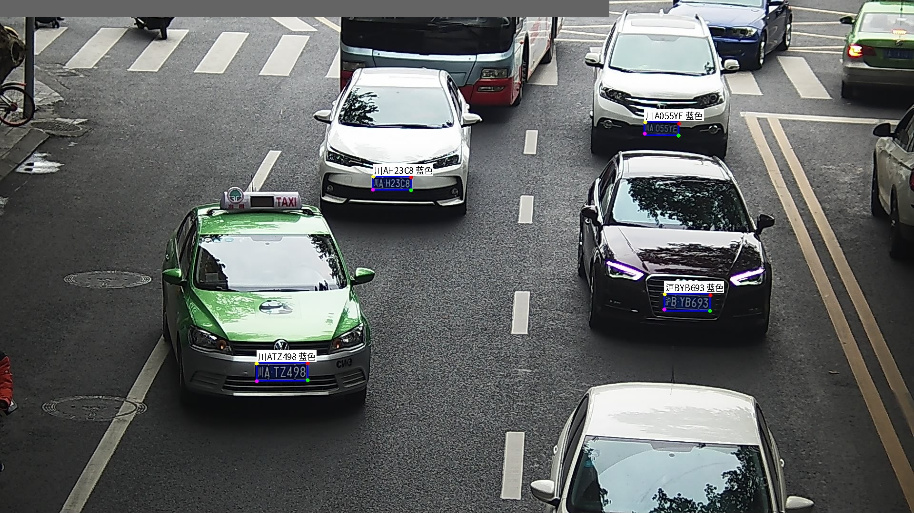
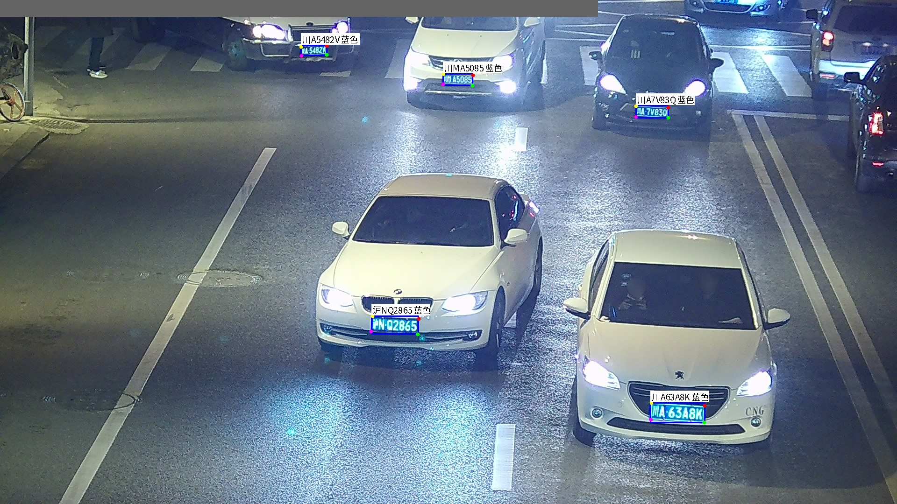
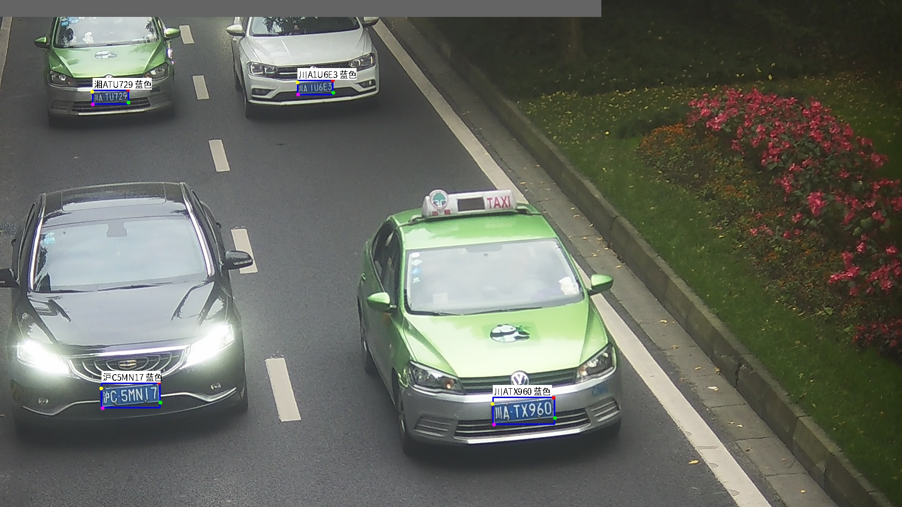
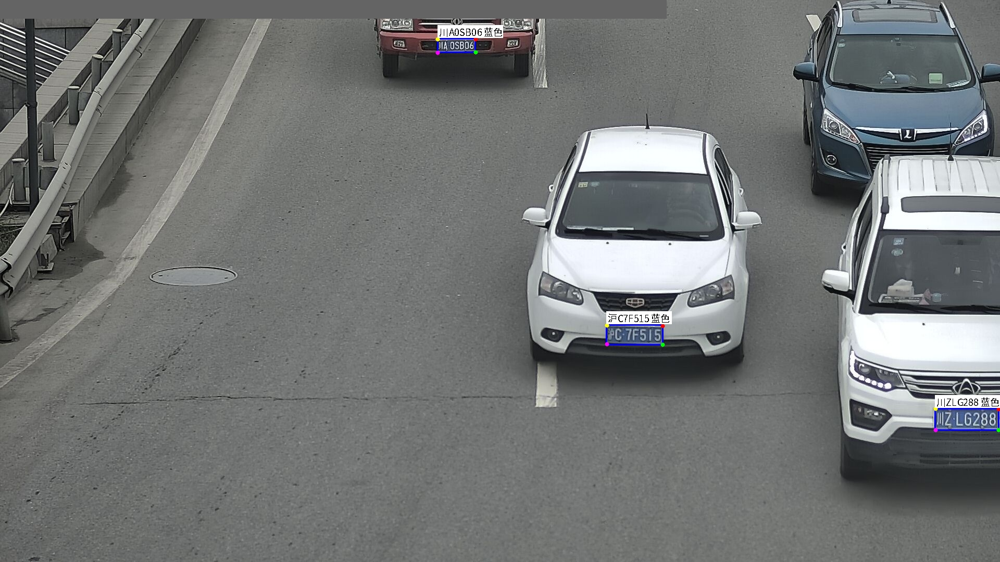
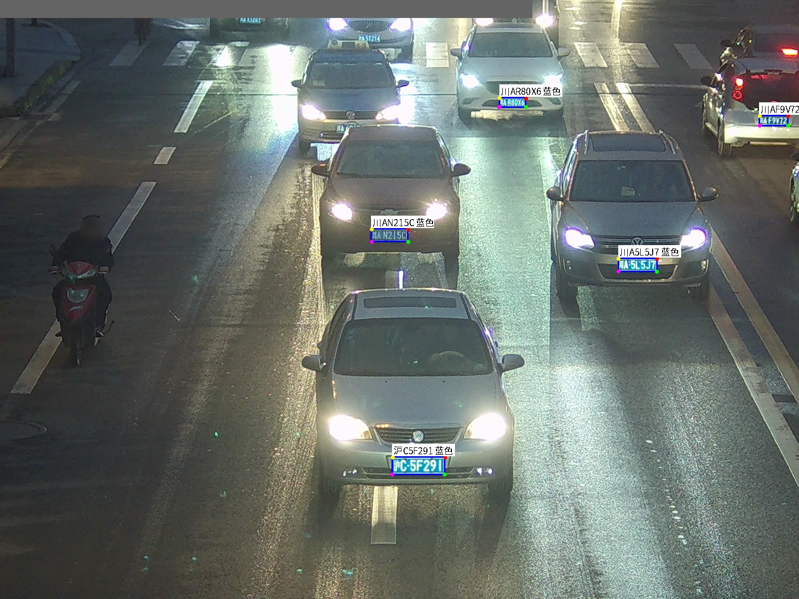
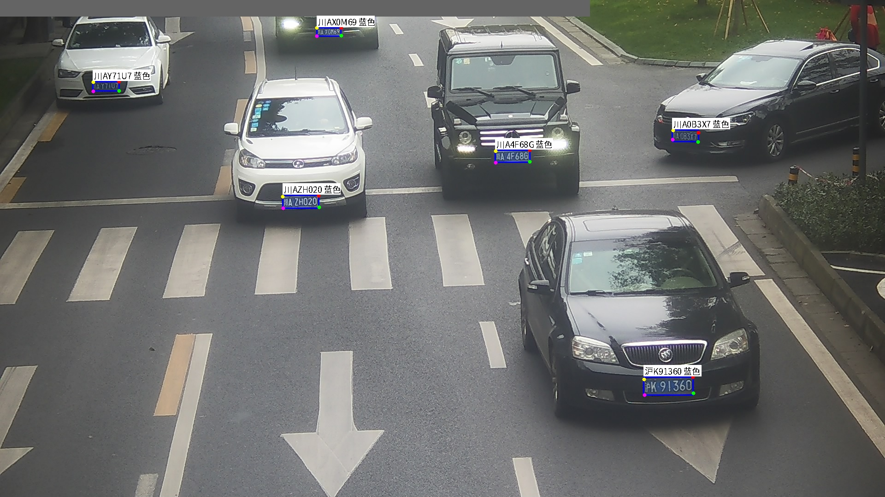
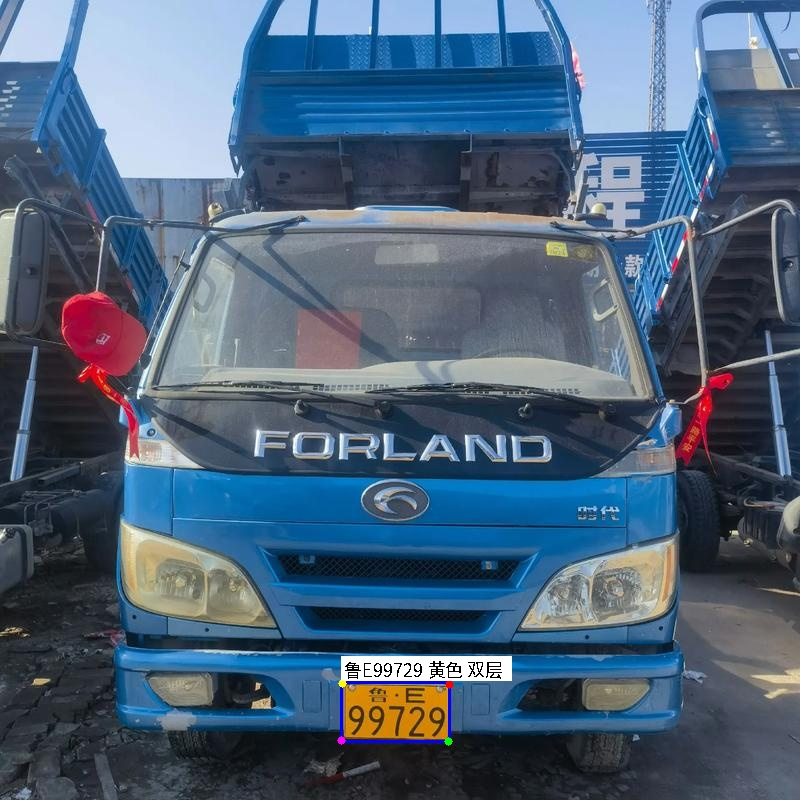
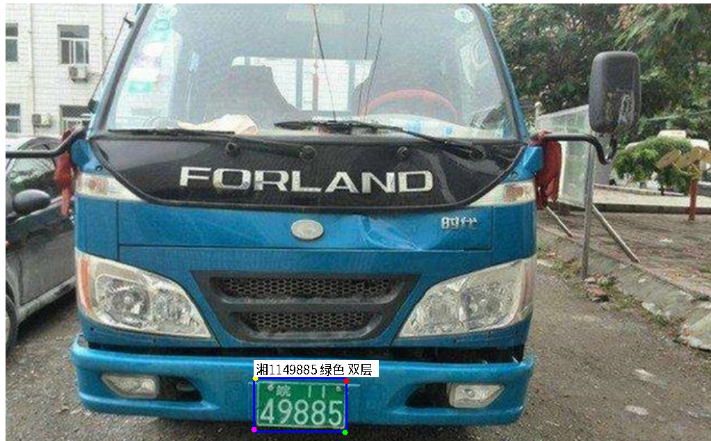
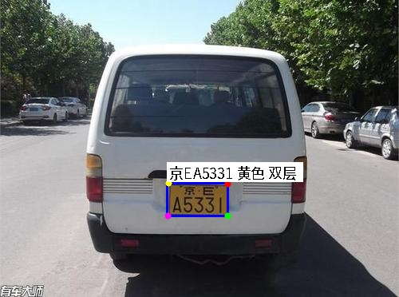
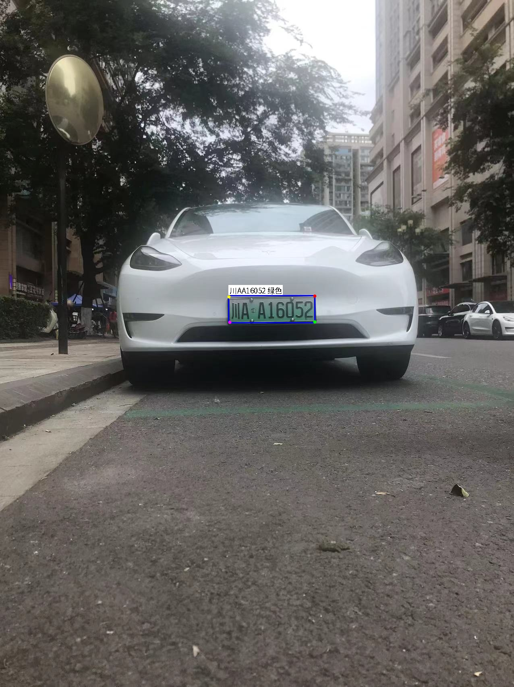
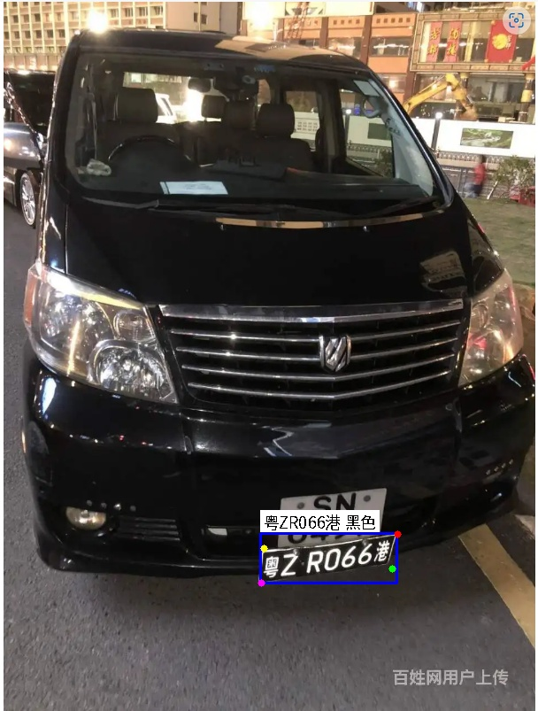
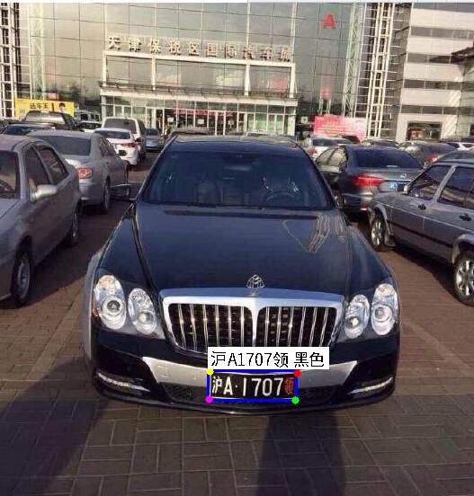
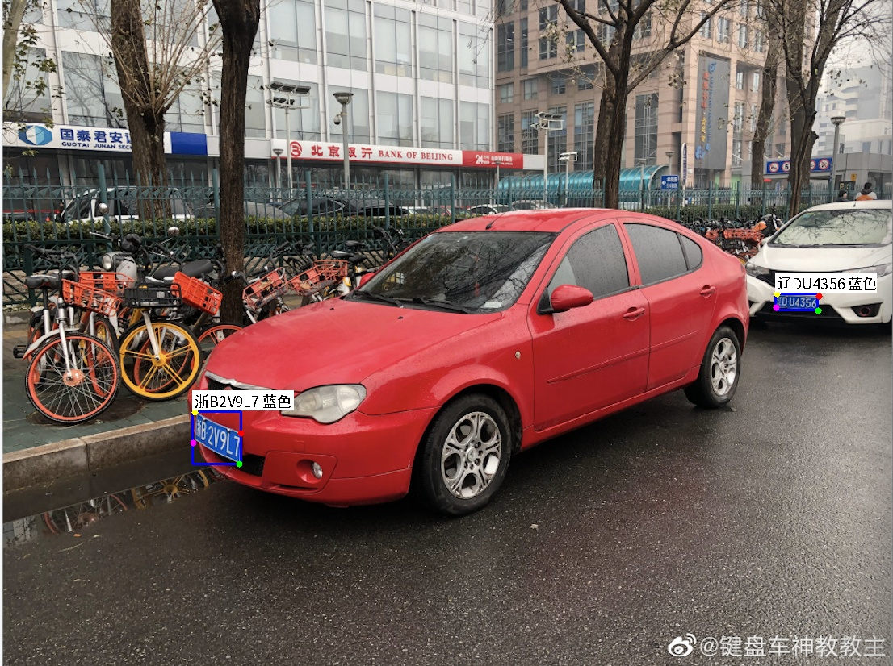
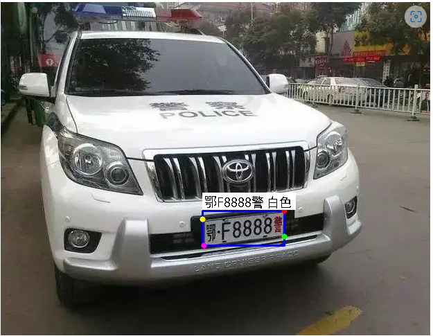
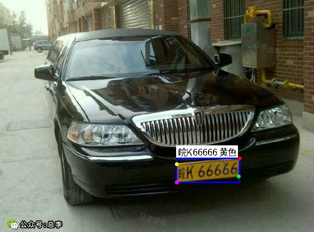


---

## 项目结构
```
yolo26_plate_recognition_tensorrt/
├── include/
│   └── common.hpp                  # 统一公共头文件
├── main.cpp                        # 联合推理主程序
├── CMakeLists.txt                  # 顶层构建文件
├── data/                           # 测试图片
├── result/                         # 推理结果输出
├── font/
│   └── NotoSansCJK-Regular.otf    # 中文字体
├── yolov26_pose/                   # 检测模块
│   ├── include/
│   │   ├── yolov26_pose.h
│   │   ├── preprocess.h
│   │   └── postprocess.h
│   ├── src/
│   │   ├── yolov26_pose.cpp
│   │   ├── preprocess.cu
│   │   └── postprocess.cu
│   └── weights/
│       └── yolo26s-plate-detect.engine
└── plate_recognition/              # 识别模块
    ├── include/
    │   └── plate_recognition.h
    ├── src/
    │   └── plate_recognition.cpp
    └── weights/
        └── plate_rec_color.engine
```

---

## 模型导出

模型导出可以参考[yolo26-plate](https://github.com/we0091234/yolo26-plate) 的`README`文档。

### 检测模型（YOLOv26-pose → ONNX → TensorRT）
```bash
# 1. 导出 ONNX
python export_onnx.py \
    --weights weights/yolo26s-plate-detect.pt \
    --imgsz 640 \
    --opset 11

# 2. 转换 TensorRT engine（在 Jetson 上执行）
/usr/src/tensorrt/bin/trtexec \
    --onnx=yolo26s-plate-detect.onnx \
    --saveEngine=yolo26s-plate-detect.engine \
    --fp16 \
    --workspace=4096
```

### 识别模型（plate_recognition → ONNX → TensorRT）
```bash
# 1. 导出 ONNX
python plate_recognition/plateNetExport.py \
    --weights weights/plate_rec_color.pth \
    --output weights/plate_rec_color.onnx

# 2. 转换 TensorRT engine（在 Jetson 上执行）
/usr/src/tensorrt/bin/trtexec \
    --onnx=plate_rec_color.onnx \
    --saveEngine=plate_rec_color.engine \
    --fp16 \
    --workspace=1024
```

---

## 编译
```bash
cd yolo26_plate_recognition_tensorrt
mkdir build && cd build

cmake .. -DCMAKE_BUILD_TYPE=Release

make -j4
```

编译完成后生成可执行文件 `plate_system`。

---

## 运行
```bash
./plate_system \
    ../yolov26_pose/weights/yolo26s-plate-detect.engine \
    ../plate_recognition/weights/plate_rec_color.engine \
    ../data \
    ../result \
    ../font/NotoSansCJK-Regular.otf
```

### 参数说明

| 参数 | 说明 | 默认值 |
|---|---|---|
| `argv[1]` | 检测模型 engine 路径 | `weights/yolo26_pose.engine` |
| `argv[2]` | 识别模型 engine 路径 | `weights/plate_rec_color.engine` |
| `argv[3]` | 输入图片目录 | `../data` |
| `argv[4]` | 结果输出目录 | `../result` |
| `argv[5]` | 中文字体路径 | `../font/NotoSansCJK-Regular.otf` |

### 输出示例
```
========================================
  Plate Detection & Recognition System
========================================
Loading detector: weights/yolo26s-plate-detect.engine
Loading recognizer: weights/plate_rec_color.engine
Found 9 images
========================================

[1/9] 37_0101.jpg
  det=18.3ms rec=2.1ms | plates=1
  [1] 鲁A·12345 蓝色 (det:0.92 col:0.97)

[2/9] 37_0106.jpg
  det=17.8ms rec=4.2ms | plates=2
  [1] 鲁B·67890 蓝色 (det:0.88 col:0.95)
  [2] 川AA·16052 黄色 双层 (det:0.85 col:0.91)
...

========================================
           Processing Summary
========================================
Total images : 9
Total plates : 12
Avg det time : 18.1 ms
Avg rec time : 3.2 ms
Avg total    : 21.3 ms
FPS          : 46.9
Results saved: ../result
========================================
```

---

## 算法流程
```
输入图像
    ↓
YOLOv26-pose 检测
    ├── 输出检测框 (xyxy)
    └── 输出4个角点关键点 (左上→右上→右下→左下)
    ↓
透视变换矫正（four_point_transform）
    ↓
双层车牌判断（plate_type == 1 → get_split_merge 拼合）
    ↓
CRNN + CTC 识别
    ├── 输出车牌号码（21步序列 → CTC解码）
    └── 输出车牌颜色（5类分类）
    ↓
结果绘制 + 保存
```

---

## Reference

- [yolo26-plate](https://github.com) — 原始训练代码与模型
- [Ultralytics](https://github.com/ultralytics/ultralytics) — YOLOv26 框架
- [NVIDIA TensorRT](https://developer.nvidia.com/tensorrt) — 推理加速

---

## License

本项目仅供学习和研究使用。